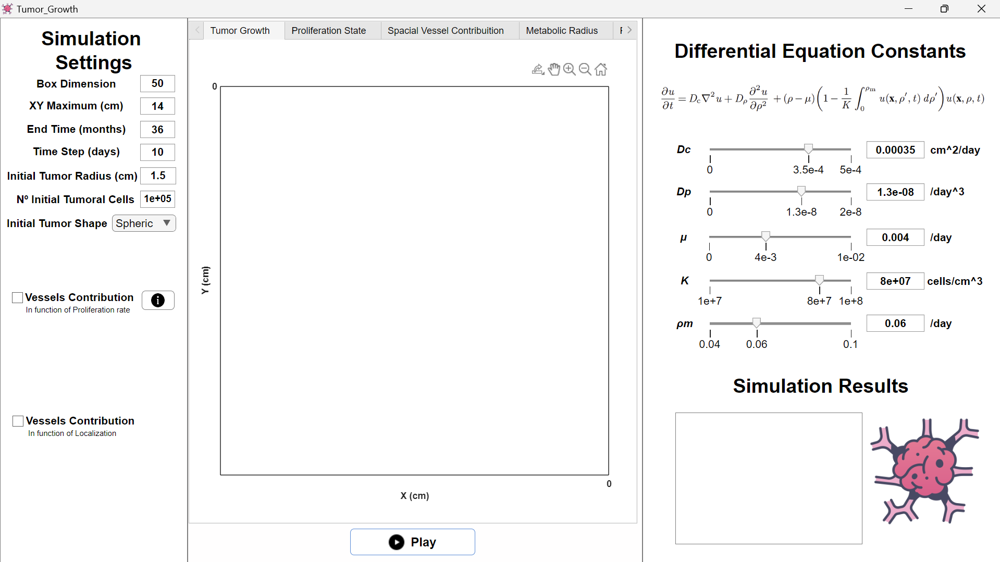

# Evolutionary Dynamics at the Tumor Edge: Metabolic Imaging Biomarkers
## Overview
This project explores the evolutionary dynamics at the edge of tumors to reveal metabolic imaging biomarkers. The work involves modeling tumor growth through quantitative approaches, integrating both internal tumor causes and environmental factors. These models help predict tumor proliferation and the spatial impact of vessel contributions.

## Purpose
The project aims to provide insights into tumor growth and proliferation through computational models. By simulating tumor dynamics under various conditions, it identifies potential imaging biomarkers for clinical applications.

## Key Features
### Tumor Growth Models
- Proliferation Maps: Illustrate tumor growth over time using different spatial and temporal parameters.
- Dynamic Simulations: Evaluate growth in spherical, random, and flower-like formations.

### Vessel Contribution Models
- Spatial Vessel Contribution: Analyze the role of vertical and circular vessel distributions in tumor proliferation.
- Environmental Effects: Account for external spatial influences on tumor development.

## Main Conclusions
1. Evolutionary dynamics at tumor edges can reveal crucial metabolic imaging biomarkers.
2. Internal and environmental factors both significantly influence tumor growth patterns.

## Requirements
MATLAB and Basic understanding of biological modeling

